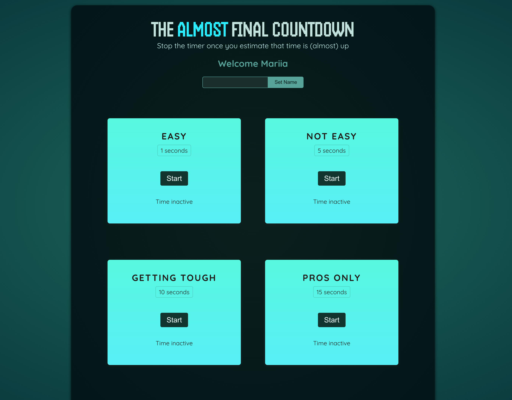
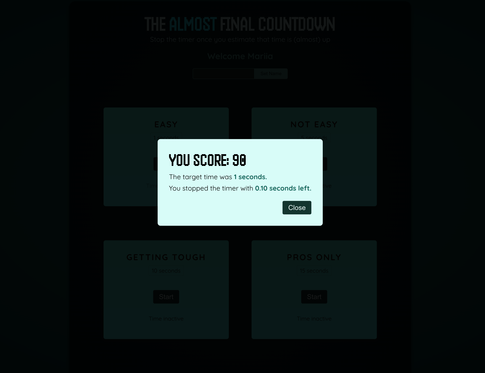

# Stop-timer-game

It is a simple but funny game created with React.

You can check out a live demo of the app at https://zoromari.github.io/stop-timer-game/

## Rules

The game rules are incredibly simple: start one of the timers (set for 1, 5, 10, or 15 seconds), and then try to stop it as close to the end of the timer as possible.

The closer the timer is to the end, the better your score will be.

However, if the timer stops and you haven't managed to stop it in time, you lose the game..

Wishing you the best of luck and loads of fun!

## Getting Started

Follow these steps to set up the project on your local machine.

Before you begin, ensure you have the following software installed:

- Node.js and npm

### Installation

1. Clone this repository to your local machine:

2. Navigate to the project directory:
cd stop-timer-game

3. Install project dependencies:
npm install

### Running the App

To start the game on your local development environment, run the following command:
npm run dev